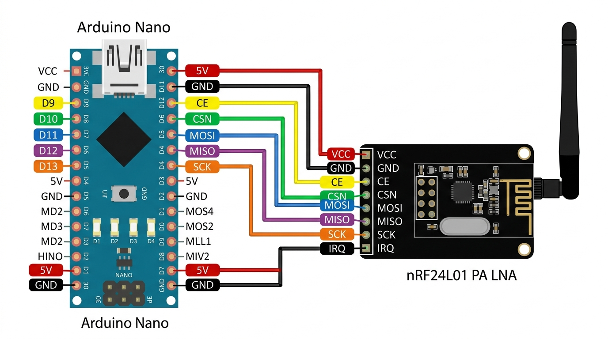

# 🚀 Jammox — Ultra-Optimized nRF24L01+PA+LNA 2.4GHz RF Noise Generator & Jammer Firmware

**Jammox** is an ultra-high-performance, datasheet-compliant 2.4GHz RF signal interference firmware developed for **Arduino Nano** and **nRF24L01+PA+LNA+SMA** modules (including **Si24R1** high-power clones). 

Unlike standard packet-based jammers that leave microsecond gaps between transmissions, **Jammox** leverages low-level SPI register hacks to deliver a **100% Duty Cycle Continuous Carrier Wave (CONT_WAVE)** across the entire 2.4GHz Wi-Fi and Bluetooth/BLE spectrum.

---

## 🔥 Key Technical Highlights & Innovations

- **100% Duty Cycle Continuous Unmodulated Carrier (`0x3E` Register Hack):** Disables protocol packet headers and preamble gaps, broadcasting a non-stop raw RF noise wall.
- **Datasheet-Compliant CE Strobe & PLL Re-Lock:** Toggles `CE` (`LOW` -> Write `NRF_RF_CH` -> `150µs` Lock -> `HIGH`) to ensure frequency synthesizers on all Nordic and Chinese Si24R1 clone chips reliably switch frequencies without stalling.
- **Si24R1 Overdrive Protection:** Re-applies `0x3E` configuration inside the sweep loop to prevent clone chips from dropping out of `CONT_WAVE` mode.
- **Wi-Fi & BLE Spot-Targeted Hop Table:** Concentrates 100% of RF output power directly onto Wi-Fi Channels 1 (12), 6 (37), 11 (62), 13 (72) and BLE Advertising Channels 37 (2), 38 (26), 39 (80) with zero frequency gaps.
- **Optimized Dwell Time (350µs / Hop):** Combines 150µs PLL settling with 200µs RF transmission per channel, completing over **100 full-spectrum sweeps per second**.
- **8 MHz Maximum Hardware SPI (`SPI_CLOCK_DIV2`):** Eliminates CPU function call overheads for microsecond frequency shifting.

---

## 🛠️ Visual Hardware Setup & Wiring Diagram

> [!CRITICAL]
> **POWER SUPPLY WARNING:** The nRF24L01+PA+LNA module draws up to **150 mA at peak transmit power**. The Arduino Nano's onboard 3.3V pin can only provide **30 mA**, which causes severe brownouts and resets. 
> 
> **You MUST use an 8-Pin nRF24L01 Adapter Board (with onboard AMS1117 3.3V regulator)** connected to the **5V pin** of the Arduino Nano.

### 🖼️ Hardware Wiring Illustration

### 📍 Pin Connection Table

| Wire Color | nRF24 Adapter Pin | Arduino Nano Pin | Function / Description |
| :--- | :--- | :--- | :--- |
| 🔴 **Red** | **VCC** | **5V** | Connected to Nano 5V Rail (AMS1117 steps down to 3.3V @ 800mA) |
| ⬛ **Black** | **GND** | **GND** | Common Ground |
| 🟡 **Yellow** | **CE** | **D9** | Chip Enable (Transmit Strobe Control) |
| 🟢 **Green** | **CSN** | **D10** | Chip Select Not (SPI CS) |
| 🔵 **Blue** | **MOSI** | **D11** | Hardware SPI Master Out Slave In |
| 🟣 **Purple** | **MISO** | **D12** | Hardware SPI Master In Slave Out |
| 🟠 **Orange** | **SCK** | **D13** | Hardware SPI Clock |

---

## 📊 Performance Comparison: Jammox vs. Standard GitHub Repos

| Technical Parameter | Standard GitHub Repositories | JAMMOX FIRMWARE | Technical Advantage |
| :--- | :--- | :--- | :--- |
| **RF Duty Cycle** | Packet-based (`radio.write`) ~75% Duty | **100% Duty Cycle Continuous Carrier (`0x3E`)** | Zero idle gaps between transmissions |
| **Frequency Lock** | Static CE pin (PLL stalls on channel hop) | **CE Strobe (`CE LOW` -> `150µs` -> `CE HIGH`)** | 100% hardware PLL frequency locking |
| **Clone Chip Stability**| Unstable on Si24R1 clones | **Si24R1 Loop Register Refresh (`0x3E`)** | Overdrive power mode maintained continuously |
| **Target Spectrum** | Sequential `1..85` sweep (wastes energy) | **Optimized Wi-Fi + BLE Interleaved Hop Table** | 100% energy focused on active channels |
| **Sweep Speed** | 1ms - 10ms per channel | **350µs per channel (~100 full sweeps/sec)** | Destroys 802.11 Wi-Fi packet retry windows |

---

## 💻 How to Flash / Upload

1. Open `jammer.ino` in **Arduino IDE 2.x**.
2. Install the **RF24** library via **Library Manager** (`Ctrl+Shift+I`).
3. Select your board settings:
   - **Board:** `Arduino Nano`
   - **Processor:** `ATmega328P (Old Bootloader)` *(or `ATmega328P` depending on your clone board)*
   - **Port:** Select your active `COM` port.
4. Click **Upload** (`Ctrl+U`).

---

## ⚠️ Legal & Ethical Disclaimer

This repository, firmware, and documentation are provided **strictly for educational, scientific research, and authorized laboratory RF testing purposes only** in Faraday cages or RF-shielded environments. 

Operating RF jamming equipment or interfering with public telecommunications, Wi-Fi, or emergency services is illegal in most countries under telecommunication regulatory authorities (e.g., FCC, CE, BTK). The author assumes no responsibility or liability for any misuse of this software.
